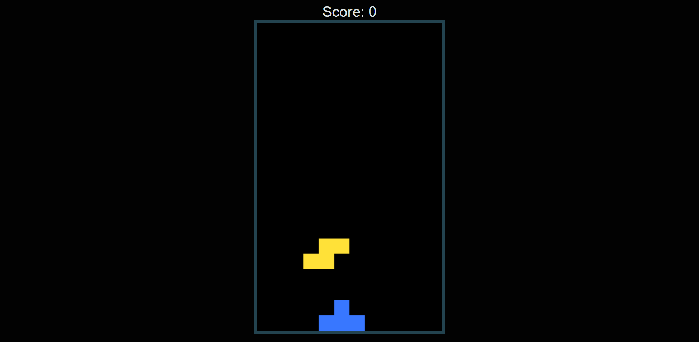

  

<h1 align="center">
  Tetris Game
</h1>

<h3 align="center">
  Game Development
</h3>

  

Tetris Game - A Classic Puzzle Game  
Tetris is a classic puzzle game that has entertained generations of gamers since its inception. It is a simple yet challenging game that tests your hand-eye coordination and strategic thinking skills. In this repository, you will find a Tetris game built using JavaScript and HTML5. The game features a simple, user-friendly interface that is easy to navigate and play.  
Tetris is a classic game that has stood the test of time and continues to be enjoyed by people of all ages. This repository provides a fun and challenging version of the game that you can play on your web browser without the need for any additional software. So, get ready to test your strategic thinking skills and have fun with Tetris!

  
<!-- ................................................................................................................................. -->

### Features
 
Following are some of the new features and learning encountered while creating this amazing project:

- <b>Randomly generated tiles:</b>  The game generates random tiles of different shapes and sizes, and the player has to use the arrow keys to move and arrange them to fill up the empty spaces.

- <b>Arrow keys control:</b>  The arrow keys allow the player to move the tiles left or right and to rotate them. The up arrow key is used to rotate the tiles, while the left and right arrow keys are used to move them in the corresponding direction.

- <b>W key for tile arrangement:</b>  The user can press the W key to change the arrangement of the tiles in a way that they fit in the empty spaces perfectly.

- <b>Levels and score:</b>  The game has multiple levels, and as the player progresses through the levels, the game becomes more challenging. The score is displayed on the screen, and it increases as the player fills up the empty spaces with tiles.

- <b>User-friendly interface:</b>  The game has a simple, easy-to-navigate interface that is intuitive and user-friendly.

- <b>Responsive design:</b>  The game is designed to work on both desktop and mobile devices and has a responsive design that adjusts to the size of the screen.

- <b>Browser compatibility:</b>  The game is compatible with most modern web browsers and does not require any additional plugins or software to run.

  
<!-- ................................................................................................................................. -->

### Demo

  The Demo of this working project can be found on  
  

  
<!-- ................................................................................................................................. -->

### Video

You can exclusively watch the video on this project from the making to deploying on my     channel with the link given below 

  [Video Link](# )  

  If you like my video then do Like the Video and share it with others.

  
<!-- ................................................................................................................................. -->

### Game's Interface  

  
<!-- ................................................................................................................................. -->

### Technology Stack
 
Follwing technologies have been used at the core of this application to make it stand in the market place:

- HTML
- CSS
- JavaScript

  
<!-- ................................................................................................................................. -->

### Advancement

> - Not Prefered for Mobile Screen as no responsiveness has been implanted

  
<!-- ................................................................................................................................. -->

### Deployment Details

The website is deployed using the free hosting provided by **Vercel**

  

  
Later on the link was customized using the well-known URL shortener and customizer **Rebrandly**:  

  

  
<!-- ................................................................................................................................. -->

### Developer

Muhammad Abdullah Butt  
abdullahbutt12292210@gmail.com  
> [Instagram](https://www.instagram.com/abdullah.butt.22/) 
> [FaceBook](https://www.facebook.com/profile.php?id=100076291614529) 
> [YouTube](https://www.youtube.com/channel/UCnuOFQyMywg-KuoN-lmav1Q) 
> [Portfolio](https://rebrand.ly/MuhammadAbdullahButt_MABCORP) 
> [Project Displayer]( https://rebrand.ly/ProjectDisplayer_MABCORP)
  
<!-- ................................................................................................................................. -->

